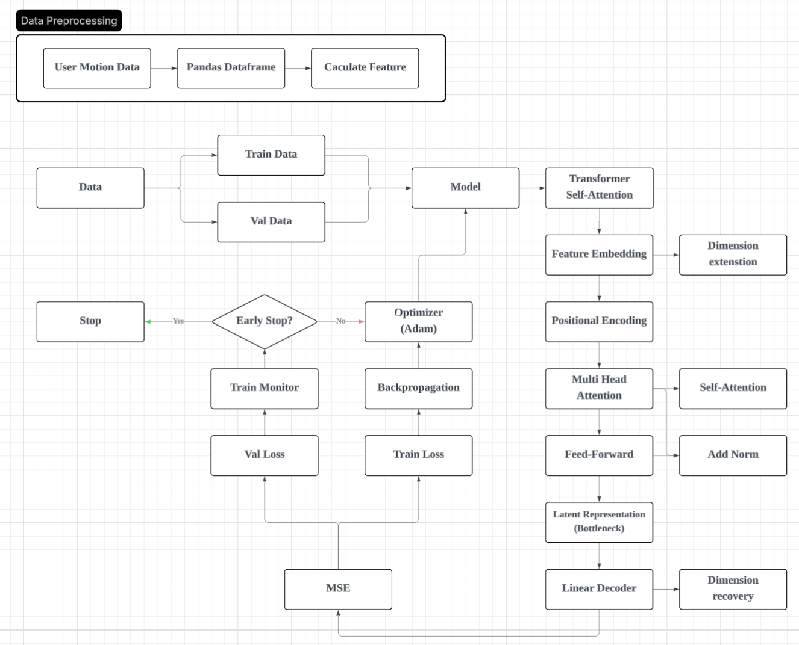

# 🤖 Model Architecture: Transformer Macro Autoencoder

Transformer 기반의 오토인코더(Autoencoder) 구조
- 정상 패턴: 모델이 높은 정확도로 복원하여 재구성 오차 0에 수렴합니다.
- 이상 패턴(매크로): 모델이 학습하지 못한 패턴이므로 복원 능력이 떨어져 재구성 오차가 높게 발생합ㄴ다.

- Feature Embedding : 5차원의 입력 피처(x, y, dist 등)를 d_model(64차원)의 고차원 벡터로 확장하여 복잡한 상관관계를 학습할 준비를 합니다.
- Positional Encoding : Transformer는 RNN과 달리 순서 정보가 없으므로, 시퀀스 내 각 위치 정보($1^{st}, 2^{nd}, ...$)를 나타내는 벡터를 더해줍니다.
- Transformer Encoder : Multi-Head Self-Attention 메커니즘을 통해 시퀀스 전체를 동시에 훑으며, 과거의 움직임이 현재에 미치는 영향을 파악합니다.
- Linear Decoder : 인코더가 뽑아낸 추상적인 특징들을 다시 원래의 5개 피처 차원으로 복원합니다.

Detection Logic
- Normal Patterns: The model reconstructs these with high precision, causing the reconstruction error to converge to zero.
- Anomalous Patterns (Macro): Since these are patterns the model has not encountered during training, the reconstruction capability decreases, resulting in a high reconstruction error.

- Feature Embedding: Expands the 5-dimensional input features (e.g., $x, y, dist$) into a high-dimensional vector of $d_{model}$ (64 dimensions) to prepare the model for learning complex correlations.
- Positional Encoding: Since Transformers do not inherently process sequential order like RNNs, this adds vectors that represent the positional information ($1^{st}, 2^{nd}, \dots$) within the sequence.
- Transformer Encoder: Utilizes the Multi-Head Self-Attention mechanism to scan the entire sequence simultaneously, capturing how past movements influence the present state.
- Linear Decoder: Reconstructs the abstract features extracted by the encoder back into the original 5-feature dimensions.



# 🚀 Macro Detector Update Ver 0.0.2

A high-precision, AI-powered mouse movement analyzer designed to distinguish between organic human input and synthetic macro patterns through OS-level event tracking and Temporal Feature Engineering.

## 🛠 Key Features & Enhancements

### 1. High-Fidelity Physics-Based Tracking
* **Enhanced Precision (Tolerance):** Introduced configurable tolerance settings for high-resolution sampling.
* **Temporal Filtering:** Ensures inference stability across various hardware environments (Low/High Hz) by stabilizing the data entry intervals.
* **Actual Physics Logic:** Migrated from a fixed-interval polling system to an **OS-level Event Listener** (`pynput.mouse.Listener`).
    * **Old:** Captured data at forced 0.02s intervals (Digitized/Artificial).
    * **New:** Captures the "Physical Truth" by recording high-precision $\Delta t$ (e.g., 0.0209s) between hardware interrupts.
    * **Impact:** Preserves human-centric micro-timing dynamics, acceleration curves, and organic jitter.

### 2. Model & Inference Upgrade
* **Training Optimization:** Increased Epochs from **50 to 300** and transitioned the loss function to **MSE (Mean Squared Error)** for superior convergence on regression tasks.
* **Post-Analysis Mode:** Added **JSON Data Inference**. You can now record mouse data and run the detector on saved `.json` files for post-event forensics.
* **Protection Mode:** Integrated a fail-safe protocol to maintain system stability and prevent crashes when interacting with restricted windows (e.g., Task Manager).

### 3. Centralized Architecture
* **Config Management:** All hyperparameters and environment variables are now managed via `config.json`.
* **Feature Engineering:** Improved calculation of **Acceleration** ($a = \Delta v / \Delta t$) and **Jerk** ($j = \Delta a / \Delta t$) by utilizing the new high-precision delta time values.

## ✨ UI & UX Improvements
* **Refined Interface:** Modernized UI components with a professional dark-themed aesthetic.
* **Interactive Tooltips:** Added a 1-second delay hint system for all dashboard parameters.
* **Tray Integration:** "Minimize to Tray" support for seamless background monitoring.
* **Enhanced Logging:** Real-time macro detection output with siren emojis and probability percentages for better visibility.


## 🔴 Critical Fix: Event-Driven Architecture
The transition from a Polling-loop to an **Event-driven** model solves the "stuttering" issue and data loss. 

| Feature | Polling System (Old) | Event Listener (New) |
| :--- | :--- | :--- |
| **Trigger** | Clock Timer (Fixed) | Physical Hardware Interrupt |
| **Time Delta** | Normalized (Forced 0.02s) | Raw High-Precision (Actual Physics) |
| **Data Quality** | Lossy / Synthetic | High-Fidelity / Organic |
| **Human Jitter** | Smoothed out (Filtered) | Captured accurately (Essential for AI) |


## 🚀 How to Run
1.  **Configure:** Edit `config.json` to set your desired `tolerance`, `threshold`, and `seq_len`.
2.  **Record/Detect:**
    * Use **Move_Data** to record new human patterns.
    * Run the **Macro Detector** for real-time monitoring.
    * Use **Json Data Inference** to analyze existing logs.
3.  **Train:** Run the training module to update the model with your custom MSE-based weights.

---

## 🚀 Update Ver 0.0.1

### 🔧 Features
* **CLI Mode Expansion:** Inference Mode now officially supports both **Windows CMD** and **Linux Terminal** environments for broader compatibility.
* **Portable Release:** Executables are now bundled and distributed as **ZIP archives** via PyInstaller, allowing for easy deployment without complex installation.

### ⌨️ Shortcuts & Commands
* **Inference Mode (CLI):** - `Start` => `Inference Mode` => `Yes`
* **Inference Mode (UI):** - `UI` => `Inference Mode` => `No`
* **Emergency Quit:** `Ctrl + Shift + Q`


---

## 📂 Data Management
* **Database Support:** Efficient data handling using **PostgreSQL** and **JSON** formats.

## 🛠 Installation
* To install the required dependencies, run the following command:
  ```bash
  pip install -r requirements.txt

## 사용 설명서 (Manual)
Manual.pptx

## 영상
[](https://youtu.be/iwi31PxQc3I)